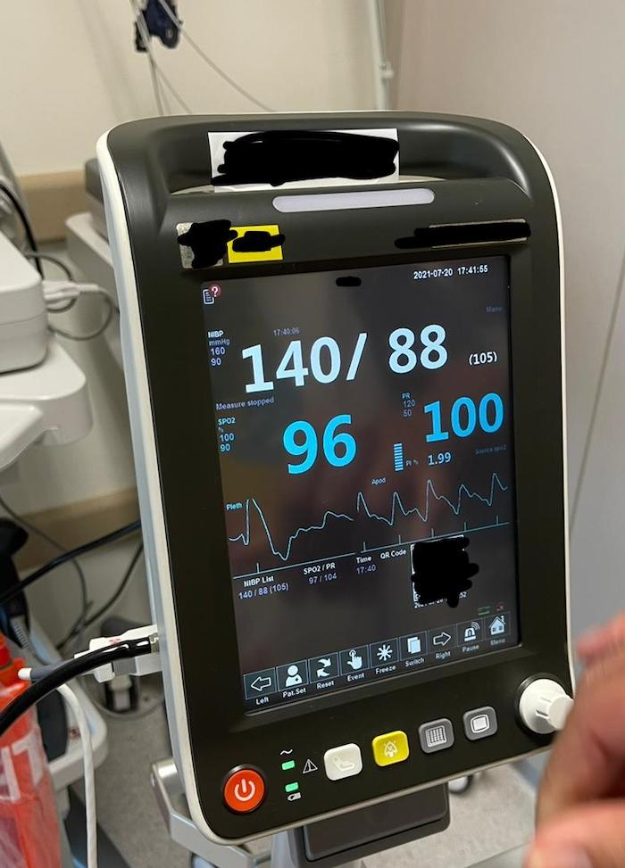
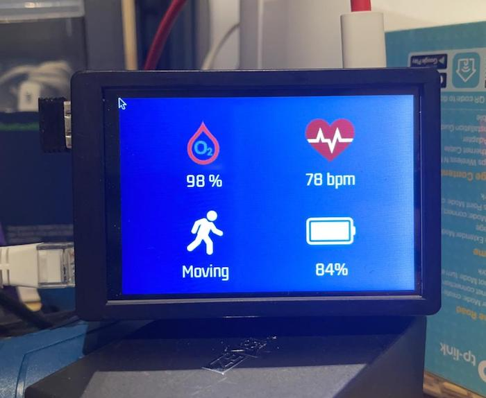

# BLE Health Device

Get signal from Vital Sign Machine with BLE and feed the data to the hospital's application.
Tech: BLE, nodejs, python, bleno

## Get data from VitalSignal through TCP protocol

## Create a GATT Service with a Raspberry Pi

## GATT Heart rate Characteristic 

## Display some information on a Raspberry Pi.

