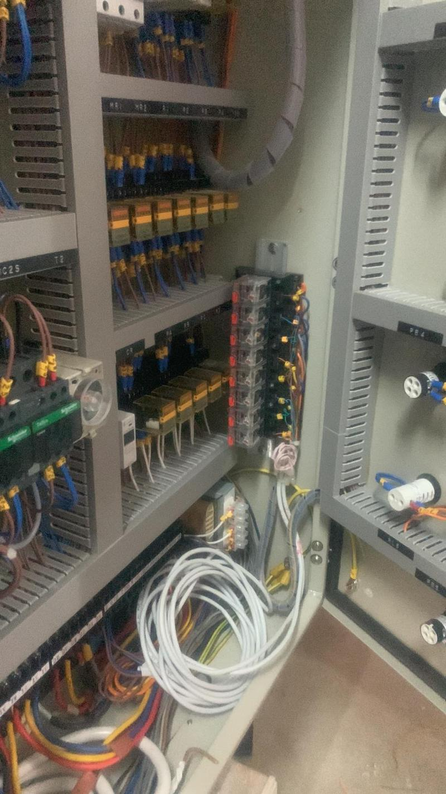
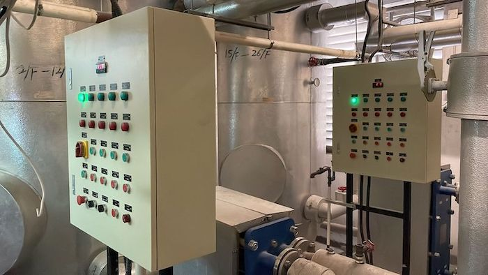
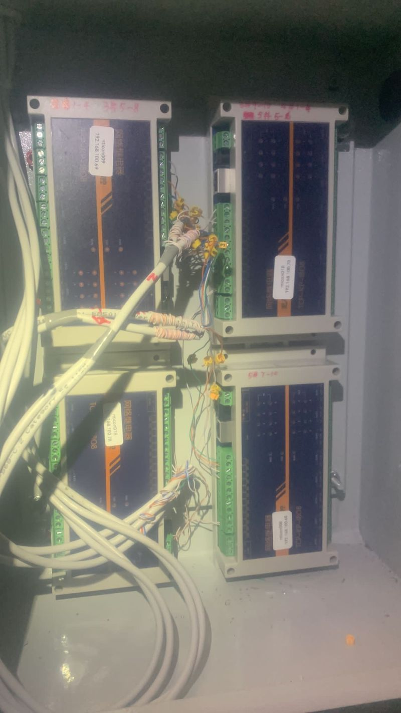
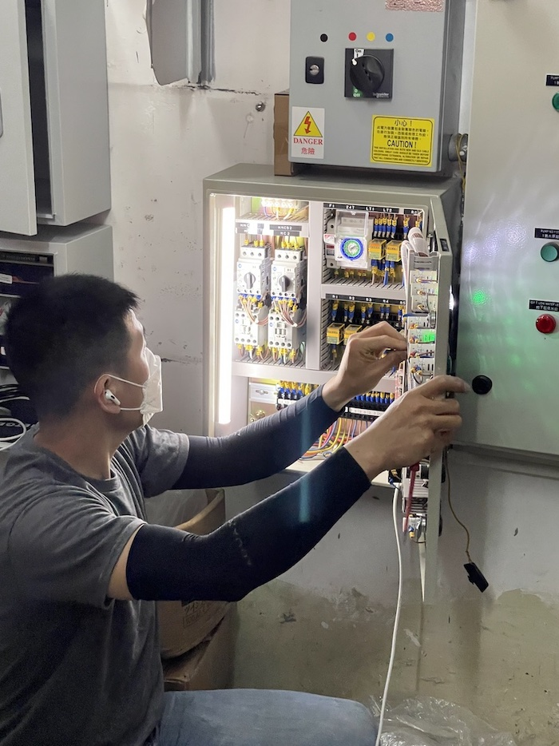

# Building Management System

Connected all building environments such as door contact, water level and bump status to the IoT platform, so that users can get alert when any event is triggered.
Tech: IO control with mqtt function, vue, node-red

## Dashboard

## Control box

