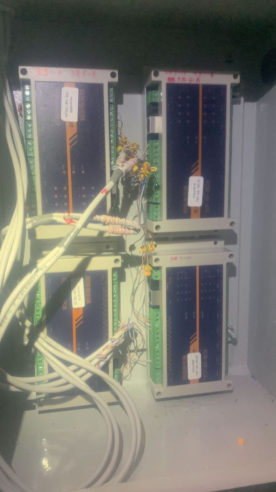

# Building Management System

Building Managament System is to connect all building environment such as door contact, water level and bump status to IoT platform, so that user can get alert when any event triggered.
Tech: IO control with mqtt function, vue, node-red

## Dashboard

## Control box

