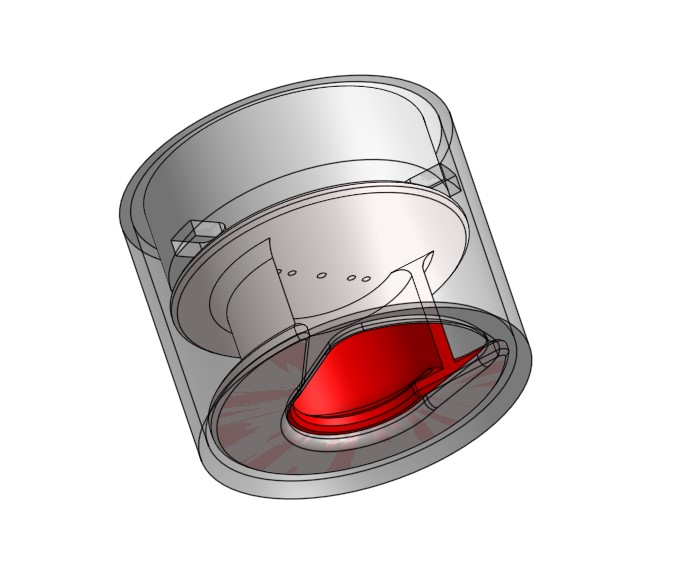
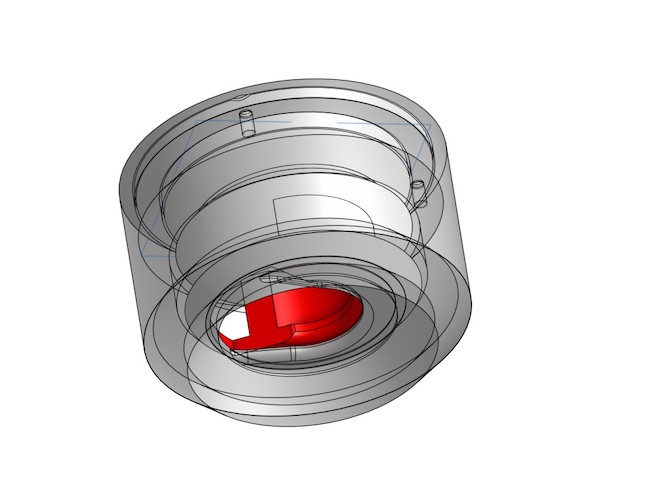
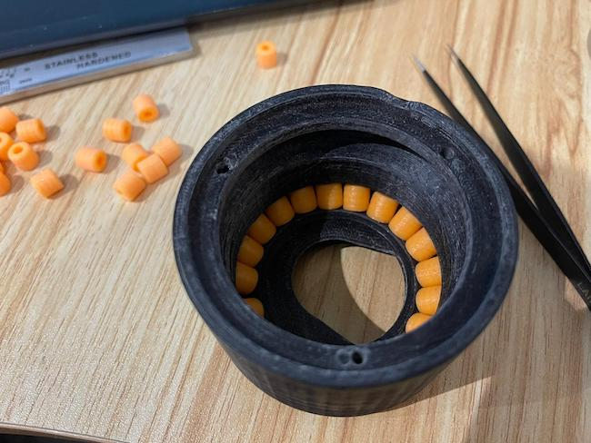
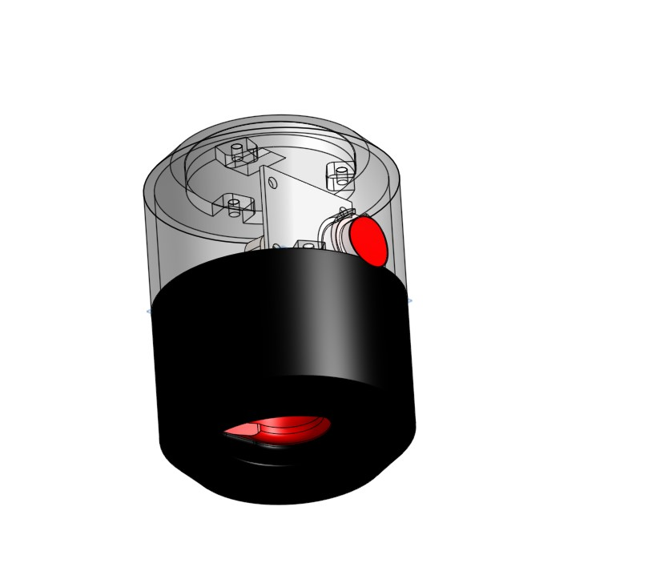
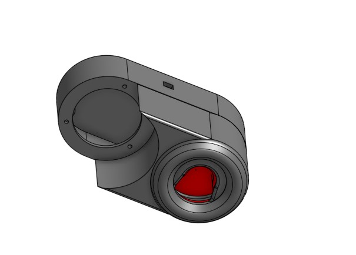
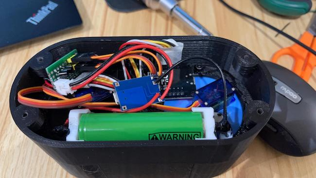

# Electric Wine Lock

Designed an Electric Wine Lock from scratch.

Tech: onshape CAD for 3D modeling, 3D printing, ESP32 MCU

## The core of the lock

Version 3 is just a simple idea for locking the bottle.

Version 4 improved the movement with bearing design.

Here is the core of the lock, all parts print by 3D printer.

Version 6 is nearly finish, added button and space for the PCB.

A demo of Version 6 here, I can open the lock with scanning a qr code.

Version 7 is for double bottle design.

Finally put them all together

Here is demo.

