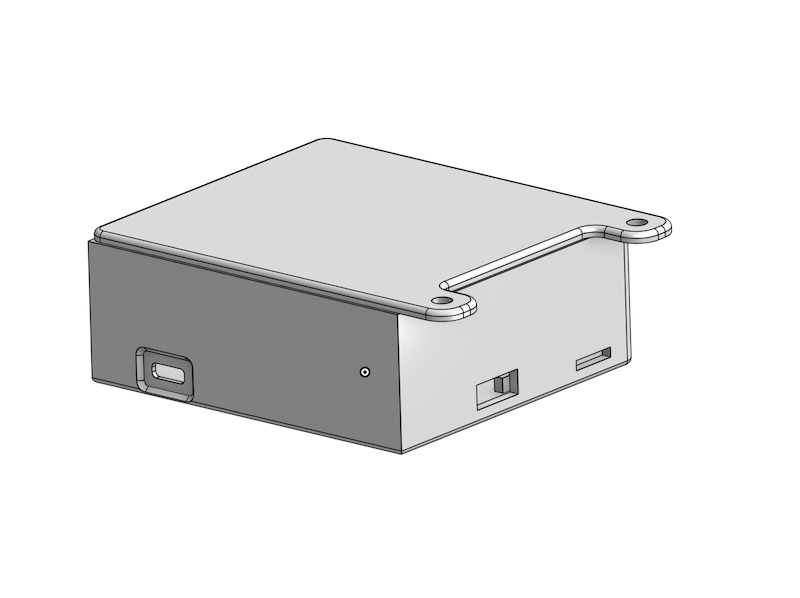

# Custom made IoT Sensor for difference 

## Wifi Sensor -> ESP32 chips develop for wifi sensor including Distance sensor, Smoke sensor, Water leakage sensor, liquid level sensor

### Circuit Diagram made with EasyEDA

### PCB made with EasyEDA

### PCB in 3D made with EasyEDA

### IAQ Sensor case made with onshap CAD

### Wifi Distance Sensor made with onshap CAD

## Zigbee Sensor -> We Flashed Tasmota firmware in a ESP32 zigbee bridge in order to connnect all zigbee devices.

### Sonoff zigbee gateway

## LoraWan Sensor ->Development with lora chips running with 3.7v battary and stand for over 2 years.

## LoraWan Distance Sensor

