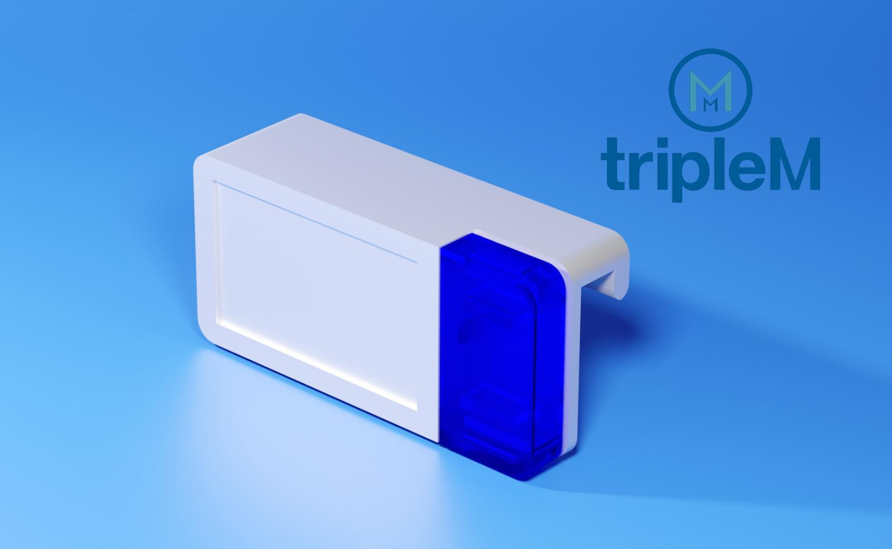
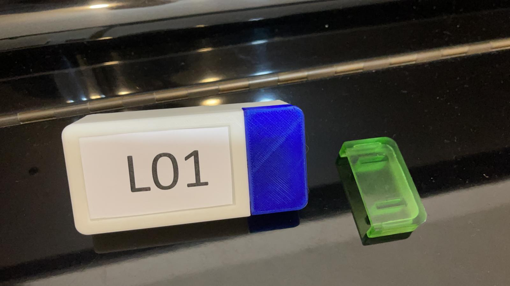

# Light for picking on shell

Light for picking on shell
1. User scan the medical prescription
2. System will find the location of the medicine and light up the correct shell
3. User pick the medicine and turn off the light

### 3D Render

### 3D printing

## An Demo video here:

