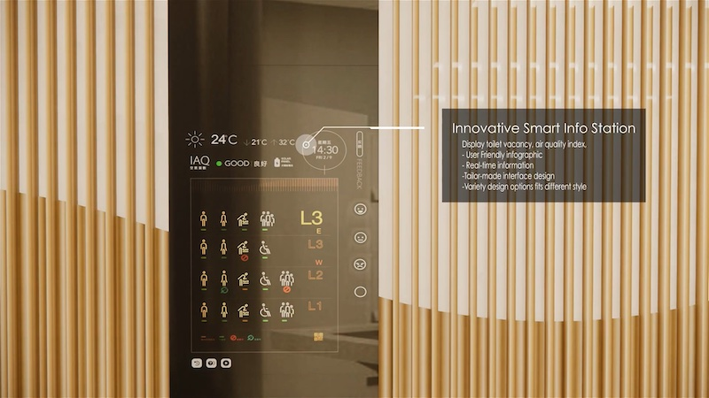
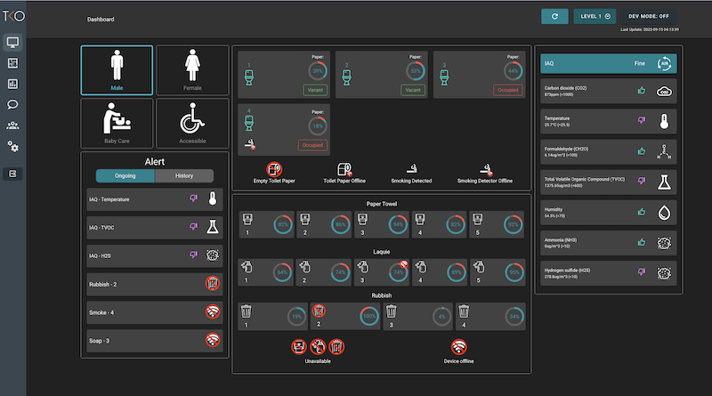
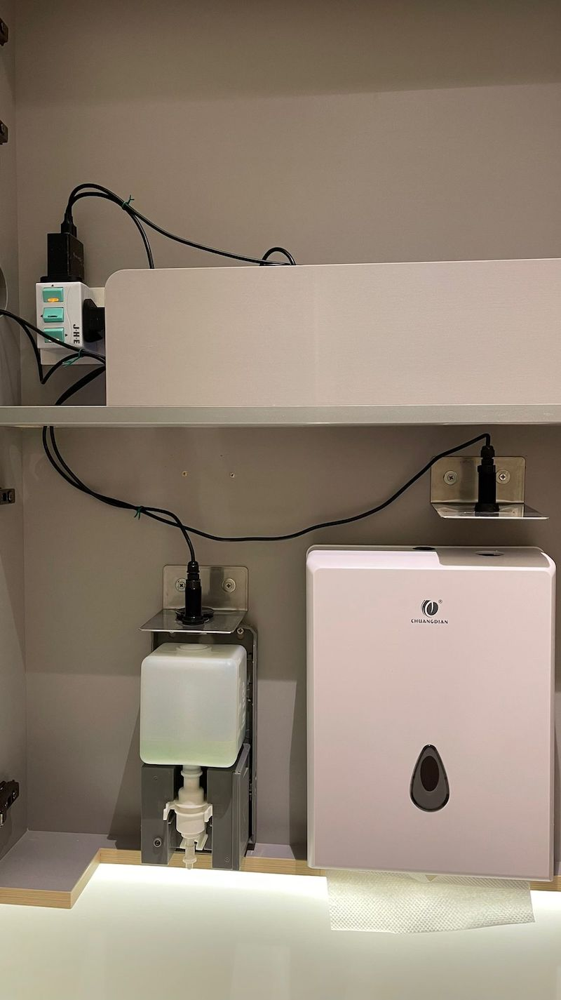
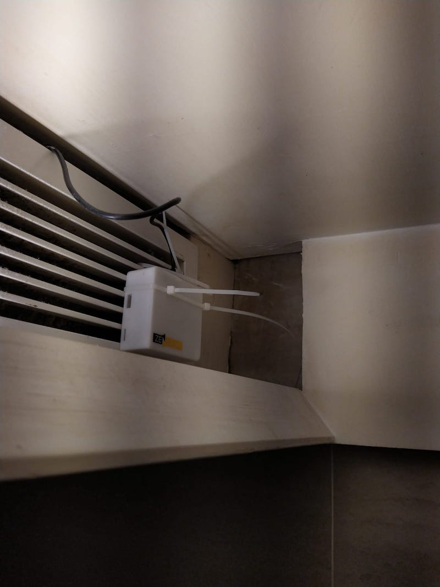
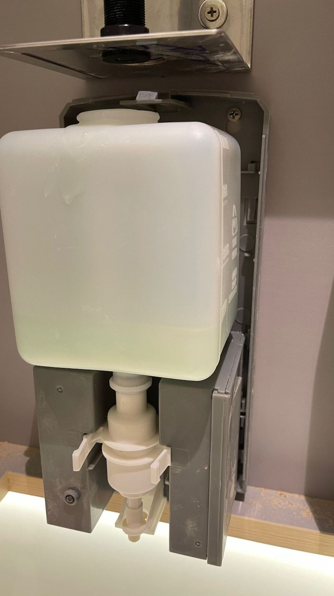
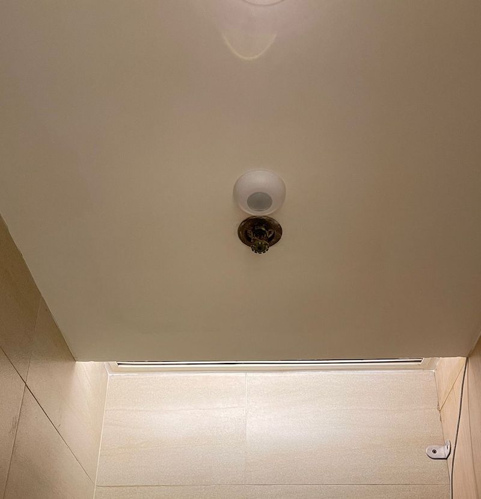

# Smart Toilet Solution
A smart toilet solution including paper, rubbish bin and soap monitoring, smoke alert and toilet occupancy.
Alert messages will be sent to the client when the event is triggered and the client can analyze data for further action.

Tech: Vue, Vuetify, Nodejs, Node-red, Mysql, Debian, Docker, Docker-compose, Grafana

## Display for client

Dashboard can show status clearly and can get alert when any event triggered.

## Dashboard for administrator

Dashboard can show status clearly and can get alert when any event triggered.

## Distance Sensor for Papar towel, rubbish bin and Soap.

## Smoke Sensor

## Soap Sensor

## PIR Sensor for detect human

## Testing video

This is a demo site for test some feature.

