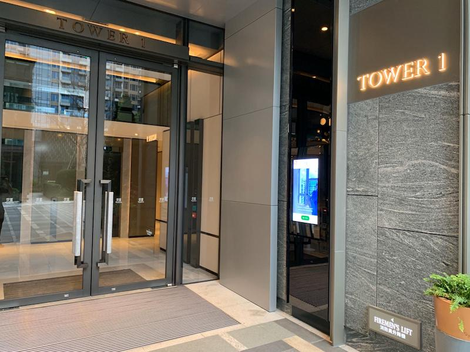
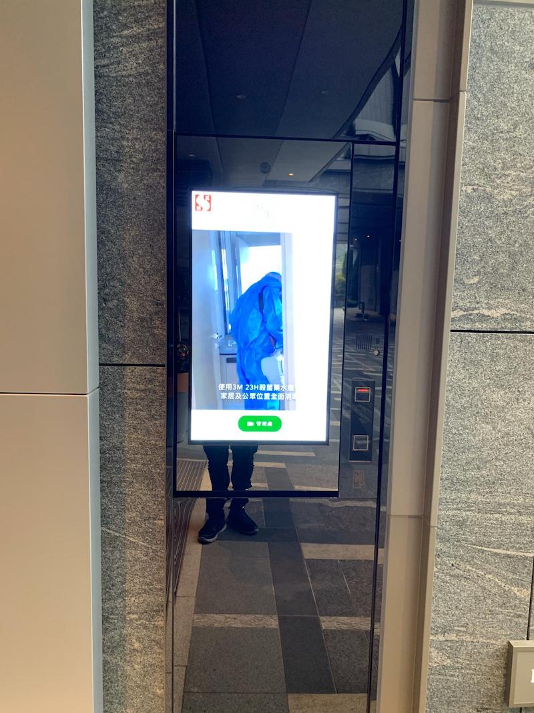

# Video Conferencing Machine

A web application to connect point to point to provide video call function and notice reading function.
Tech: Webrtc, Chromium, Nodejs, JS

## Installed in ground floor

## Front view

## This is a demo site for test some feature.

